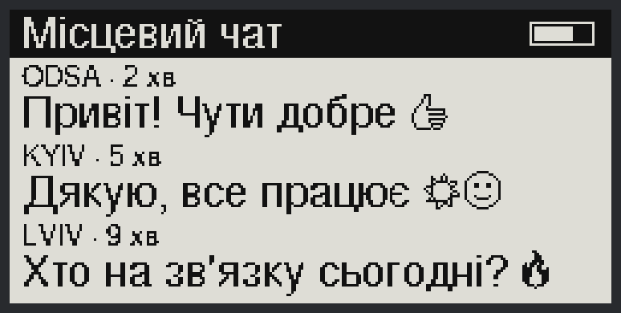
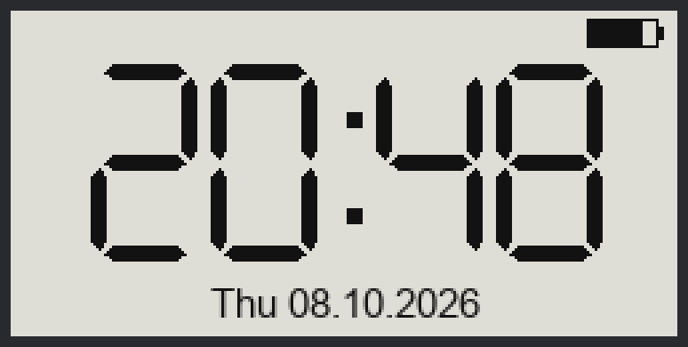
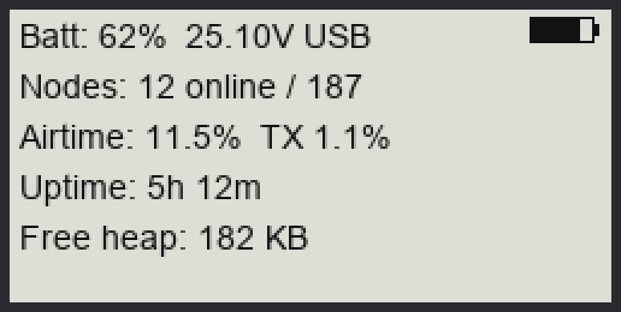

# Meshtastic Wireless Paper · InkHUD Clock, Node Status & Cyrillic

[](LICENSE)
[](https://github.com/meshtastic/firmware/releases)
[](https://heltec.org/project/wireless-paper/)
[](../../releases)

A small, clean add-on for the **Heltec Wireless Paper** (E-Ink) running Meshtastic **InkHUD**:

- 🕒 **Big clock** – a full-screen seven-segment clock in the same look as the classic Meshtastic UI, with weekday and date.
- 📊 **Node status** – battery, mesh size, channel/TX airtime, uptime and free memory on one page.
- 🔤 **Cyrillic text** – Ukrainian and Russian messages are rendered correctly on the E-Ink screen.

It ships in two forms, so you can pick what suits you:

| | Prebuilt firmware | Patch |
|---|---|---|
| For | Just want it to work | Want to audit, rebase or customise |
| Get it | [Releases](../../releases) (`.factory.bin` / `.app.bin`) | [`patches/`](patches) |
| Effort | Flash and go | Build with PlatformIO |

> **Base firmware:** official Meshtastic `v2.7.26.54e0d8d`. Every release states the exact base version in the file name
> (e.g. `…_v1.0.0_fw2.7.26.54e0d8d.factory.bin`).

---

## Screens

The clock and status images are **simulated previews** of the layout (the clock geometry uses the same arithmetic as the
firmware code). The **messages** image is rendered from the **real InkHUD bitmap font tables**, so Ukrainian letters and
emoji look exactly like on the device – only the screen layout is simulated. None of them are photos.
Regenerate them with [`docs/render_preview.py`](docs/render_preview.py).

<p align="center">
  
  <br><sub>Ukrainian text and emoji</sub>
</p>
<p align="center">
  
  &nbsp;&nbsp;
  
  <br><sub>Big clock &nbsp;·&nbsp; Node status</sub>
</p>

### Clock
- Seven-segment digits with beveled segment ends (same style as the classic Meshtastic clock), auto-scaled to the screen.
- 12 h or 24 h according to your device setting; local time uses the timezone configured on the device.
- Redraws **once a minute, only while it is on screen**, and skips redundant redraws – gentle on the E-Ink panel and the battery.
- Keeps the top 18 px free so the InkHUD battery icon never overlaps the digits.
- Shows `--:--` and `Time not set` until the node has valid time (phone sync or GPS).

### Node status
- **Battery** %, voltage and `CHG` / `USB` indicator.
- **Nodes** online / known in the node database.
- **Airtime**: channel utilisation and your TX share.
- **Uptime** and **free heap**.
- Refreshes when opened and every 5 minutes while visible.

### Cyrillic
- Switches the InkHUD fonts from Windows‑1252 to **Windows‑1251** (the Win1251 FreeSans fonts already shipped inside upstream InkHUD).
- Ukrainian/Russian letters render properly in messages, node names and channel names.
- ⚠️ **Trade-off:** Windows‑1251 contains the basic Latin alphabet and Cyrillic but *not* the Western‑European accented letters
  (é, ü, ñ …) that Windows‑1252 has. If you mostly read those, this patch is not for you.
- Upstream's built‑in emoji set keeps working (👍 😊 😂 👋 ☀ ❤ 🔥 🎉 and more are drawn as bitmaps).

---

## Quick start

### Option A – prebuilt firmware (recommended)

1. **Back up your node first** (see [docs/INSTALL.md](docs/INSTALL.md#0-back-up-your-configuration)).
2. Download the latest `…app.bin` from [Releases](../../releases) and verify it against `SHA256SUMS`.
3. Flash only the **app partition** – your channels, keys and settings are kept:

   ```bash
   pip install esptool
   esptool.py --chip esp32s3 --port /dev/cu.SLAB_USBtoUART --baud 460800 erase_region 0xE000 0x2000
   esptool.py --chip esp32s3 --port /dev/cu.SLAB_USBtoUART --baud 460800 --after hard_reset write_flash 0x10000 <file>.app.bin
   ```

   or use the helper: `scripts/flash.sh <file>.app.bin`.
4. Enable the new screens: open the InkHUD menu (long-press the user button) and switch **Clock** and **Node Status** on.

Full details, the web-flasher route and recovery steps: **[docs/INSTALL.md](docs/INSTALL.md)**.

### Option B – build it yourself

```bash
git clone https://github.com/osahv/meshtastic-wireless-paper-inkhud.git
cd meshtastic-wireless-paper-inkhud
scripts/build.sh          # clones upstream at the pinned tag, applies the patch, builds with PlatformIO
```

See **[docs/BUILD.md](docs/BUILD.md)**. Prefer a different Meshtastic version? Apply the patch to it and fix conflicts –
the change is intentionally tiny (4 new files, ~10 modified lines).

---

## What exactly changes?

| File | Change |
|---|---|
| `variants/esp32s3/heltec_wireless_paper/nicheGraphics.h` | Win1251 fonts; registers the two new applets |
| `…/InkHUD/Applets/User/Clock/ClockApplet.{h,cpp}` | **new** – big clock |
| `…/InkHUD/Applets/User/NodeStatus/NodeStatusApplet.{h,cpp}` | **new** – status page |

Nothing touches LoRa, Bluetooth, the node database, power management or the message handling. The full diff is in
[`patches/`](patches).

## Compatibility

| Item | Status |
|---|---|
| Heltec Wireless Paper | ✅ tested on one unit (author's), Meshtastic `2.7.26.54e0d8d` |
| Other Meshtastic versions | ⚠️ patch may need a small rebase |
| Other InkHUD boards (T‑Echo, Vision Master …) | ❌ not tested – the applets are generic, but each board has its own `nicheGraphics.h` |

## Good to know

- E‑Ink panels do a periodic full refresh (a flash) to clear ghosting; that is upstream InkHUD behaviour, not part of this patch.
- Time comes from your phone (BLE) or GPS. After a full power loss the clock shows `--:--` until the phone reconnects.
- Flashing custom firmware is at your own risk. See [docs/FAQ.md](docs/FAQ.md) for recovery.

## Documentation

- [Install / flash / recover](docs/INSTALL.md)
- [Build from source](docs/BUILD.md)
- [How it works & customisation](docs/ARCHITECTURE.md)
- [FAQ & troubleshooting](docs/FAQ.md)
- [Changelog](CHANGELOG.md) · [Contributing](CONTRIBUTING.md)

## License & credits

Licensed under **GPL‑3.0**, like the Meshtastic firmware this patch is derived from – see [LICENSE](LICENSE) and [NOTICE](NOTICE).

This is an independent community project. It is **not affiliated with or endorsed by Meshtastic LLC or Heltec**.
Built on the excellent [Meshtastic firmware](https://github.com/meshtastic/firmware) and its InkHUD UI.

If it is useful to you, a ⭐ helps others find it.
